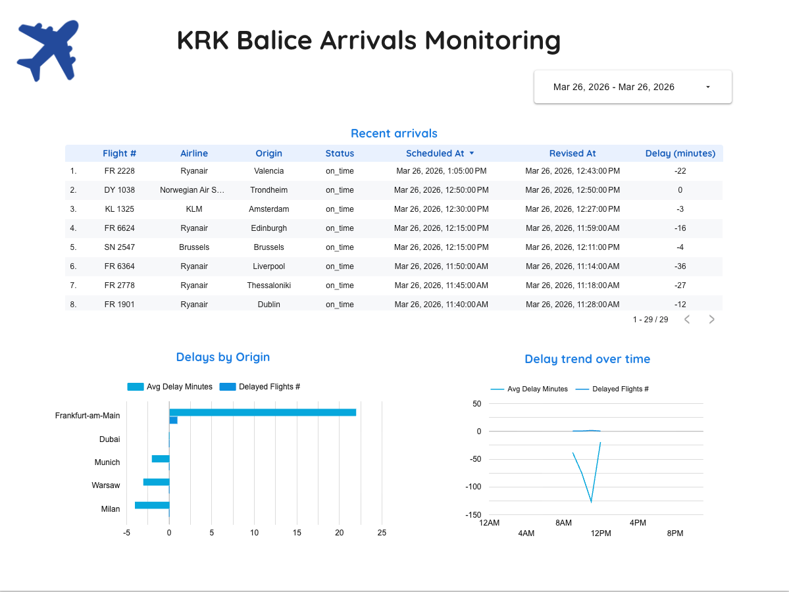

# KRK Arrivals Streaming Pipeline

Real-time data engineering project for monitoring arrivals and delays at Krakow Airport (KRK / Balice).

The project uses AeroDataBox as the flight-status source and is built as a streaming pipeline with Redpanda/Kafka, Flink, GCS, BigQuery, dbt, Airflow, Looker Studio, and Terraform.

## Problem statement

The goal is to monitor inbound flights to Krakow Airport in near real time and answer questions such as:

- which arrivals are currently delayed
- which origin airports generate the highest delays
- how delay patterns change over time

The raw source is polled repeatedly, so the pipeline stores append-only snapshots in the raw layer and deduplicates to the latest flight state in dbt for dashboarding.

## Dashboard scope

- Tile 1: Recent arrivals table with flight status
- Tile 2: Delay distribution by origin airport
- Tile 3: Delay trend over time

## Dashboard Preview



## Architecture

`AeroDataBox -> publisher -> Redpanda/Kafka -> Flink -> GCS -> Airflow -> BigQuery -> dbt -> Looker Studio`

Current behavior:

1. `ingestion/producer.py` fetches KRK arrivals from AeroDataBox
2. `ingestion/publisher.py` runs continuously in Docker and publishes batches to Kafka every 5 minutes
3. `streaming/flink-jobs/src/write_to_gcs_job.py` consumes Kafka messages and writes raw JSON files to GCS
4. `orchestration/dags/krk_pipeline_dag.py` runs every 5 minutes, loads GCS files into BigQuery, then runs `dbt run` and `dbt test`
5. `warehouse/dbt/krk_flights_dbt` builds staging, a deduplicated latest-flight intermediate model, and dashboard marts
6. Looker Studio reads the mart tables

## Repository structure

```text
.
├── dashboards/
│   └── looker/                    # Dashboard notes and screenshots
├── docs/
│   └── architecture.md            # Schema and architecture notes
├── infra/
│   └── terraform/
│       ├── environments/
│       │   └── dev/               # Terraform entrypoint for GCP resources
│       └── modules/
│           ├── bigquery/          # BigQuery dataset module
│           └── gcs/               # GCS bucket module
├── ingestion/
│   ├── producer.py                # AeroDataBox extraction and normalization
│   ├── publisher.py               # Continuous Kafka publisher
│   └── README.md
├── orchestration/
│   ├── dags/                      # Airflow DAGs
│   ├── dbt_profiles/              # dbt profile mounted into Airflow
│   └── README.md
├── streaming/
│   └── flink-jobs/                # PyFlink jobs
├── docker-compose.yml             # Main local runtime stack
├── Dockerfile.airflow
├── Dockerfile.flink
├── Dockerfile.publisher
└── warehouse/
    ├── bigquery/                  # BigQuery notes
    └── dbt/
        └── krk_flights_dbt/       # dbt project with staging/intermediate/marts
```

## Main components

- `publisher`: long-running ingestion service polling AeroDataBox
- `Flink`: Kafka-to-GCS raw sink
- `Airflow`: GCS-to-BigQuery load plus dbt orchestration
- `dbt`: staging, deduplication, and dashboard marts
- `Terraform`: GCS bucket and BigQuery dataset infrastructure

## How To Run

1. Start the local runtime stack:

```bash
docker compose up --build -d redpanda publisher jobmanager taskmanager airflow
```

2. Submit the Flink job:

```bash
docker compose exec jobmanager flink run -py /opt/flink/jobs/write_to_gcs_job.py
```

3. Open Airflow:

```text
http://localhost:8085
```

4. Enable or trigger the `krk_pipeline` DAG if needed.

5. Run dbt locally if you want to rebuild manually:

```bash
cd warehouse/dbt/krk_flights_dbt
dbt run
dbt test
```

## Dashboard datasets

The dashboard is built from:

- `mart_recent_arrivals`
- `mart_delay_distribution`
- `mart_delay_trend`

## Notes

- The raw layer is append-only and may contain repeated flight snapshots from repeated polling.
- Deduplication happens in dbt through `int_latest_arrivals`, which keeps the latest record per `flight_number + scheduled_arrival_utc`.
